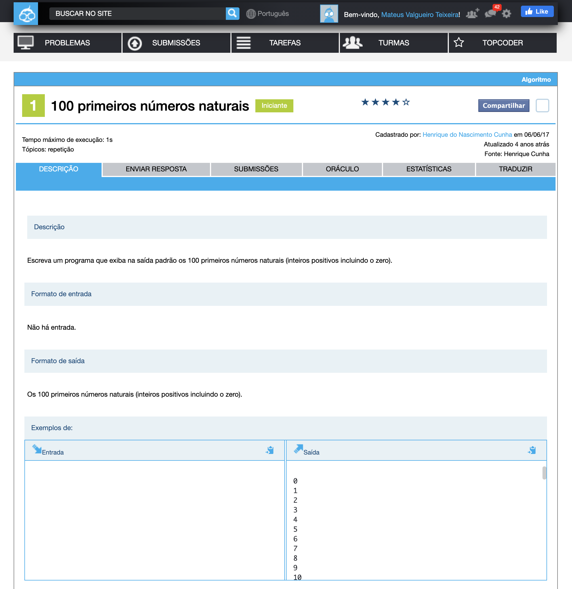
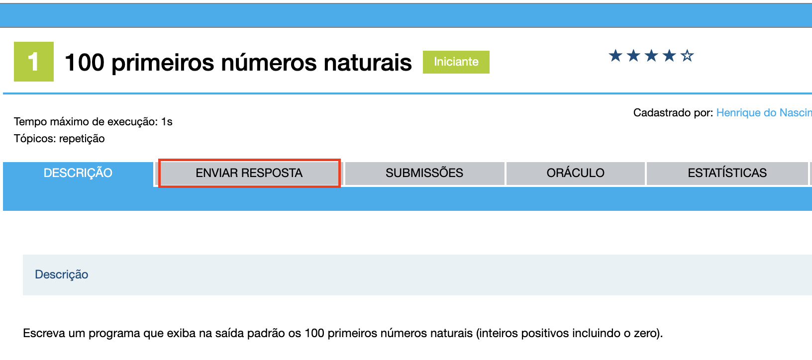
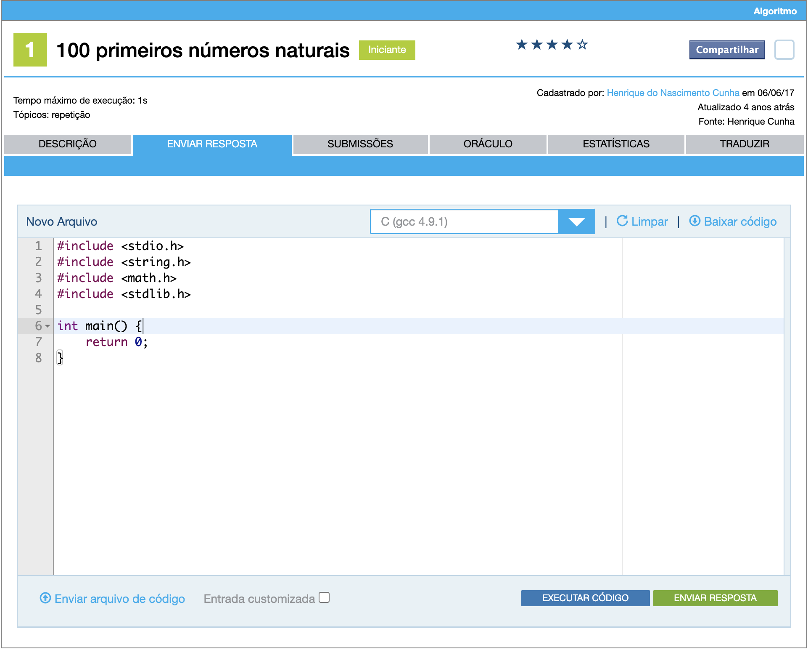
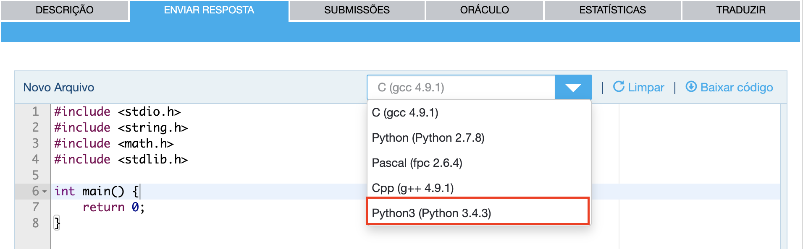
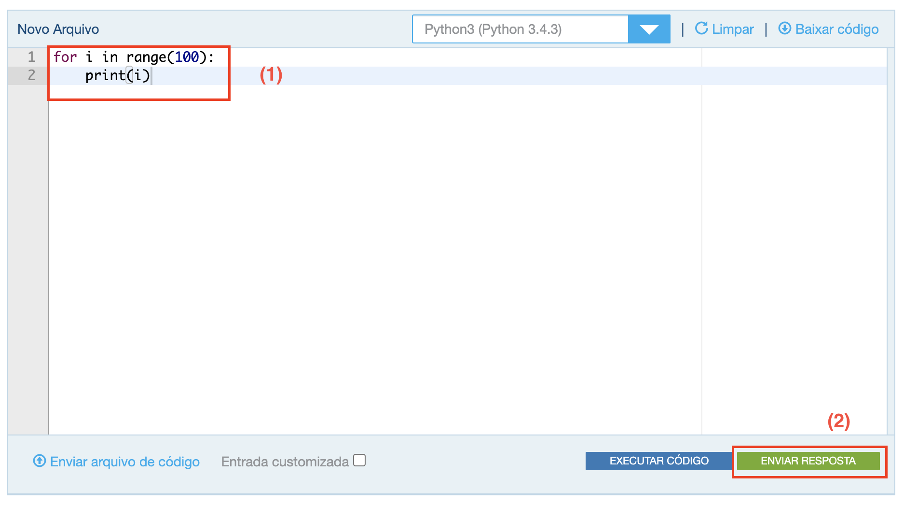
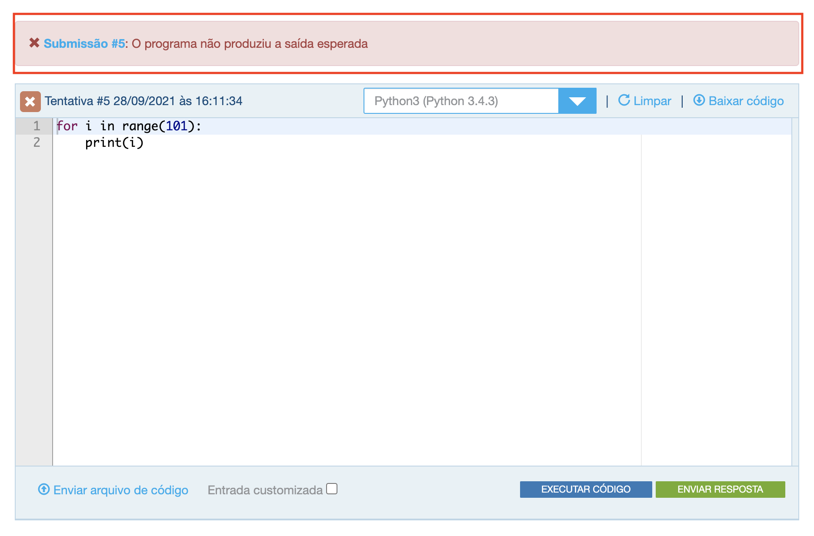

# Tutorial de Primeiros Passos no The Huxley


## Tabela de conteúdos
- [Tutorial de Primeiros Passos no The Huxley](#tutorial-de-primeiros-passos-no-the-huxley)
  - [Tabela de conteúdos](#tabela-de-conteúdos)
  - [1. Enviando a resposta de um problema](#1-enviando-a-resposta-de-um-problema)
    - [1.1 Pagina de detalhes do problema](#11-pagina-de-detalhes-do-problema)
    - [1.2 Envio de resposta](#12-envio-de-resposta)
    - [1.3 Resultado do envio](#13-resultado-do-envio)
  - [2. Pegando informações da entrada em Python](#2-pegando-informações-da-entrada-em-python)
    - [2.1 Lista de números na mesma linha](#21-lista-de-números-na-mesma-linha)
  - [3. Problemas Comuns](#3-problemas-comuns)
    - [3.1 Você não está programando para um usuário](#31-você-não-está-programando-para-um-usuário)
    - [3.2 Explicando respostas de juízes online](#32-explicando-respostas-de-juízes-online)
  - [4. FAQ](#4-faq)
  - [5. Fontes](#5-fontes)


## 1. Enviando a resposta de um problema

Para este passo, é necessário que você já tenha criado seu usuário e se cadastrado na plataforma.

### 1.1 Pagina de detalhes do problema

Para enviar a resposta de um problema, é necessário primeiramente resolvê-lo 😅. Para isto, assim que acessamos a página de detalhes de um problema é mostrada a aba de descrição do mesmo, que contém informações sobre o contexto, assim como as entradas e saídas esperadas. Aqui está um [exemplo de um problema](https://thehuxley.com/problem/1087?locale=pt_BR): 



### 1.2 Envio de resposta

Para enviar uma resposta, é necessário acessar a aba de "Enviar resposta":



Ao clicar na aba, entramos na visualização de envio de respostas. Nela é possível ver que a plataforma The Huxley conta com uma IDE online para testes de entradas e saída e submissão do código resposta das questões.



Primeiramente, devemos escolher a linguagem na qual resolveremos o problema em questao, utilizando o combobox. Como estamos este tutorial está voltado para alunos que estão aprendendo Python 3, vamos escolher esta.



Após isso podemos colocar o código da resolução da questão e apertar no botão de **enviar resposta** para confirmar o envio.



### 1.3 Resultado do envio

Caso tudo esteja correto e todos os casos de teste passem, está deve ser a tela que você deverá ver. O quadrado representando o status do problema agora mostrará um ✅, e o The Huxley mostrará uma mensagem dizendo que o problema foi resolvido com sucesso. Parabéns, você acaba de resolver seu primeiro problema na plataforma 😄!


Caso algum caso de teste tenha falhado, o The Huxley mostrará a seguinte tela. O quadrado representando o status do problema agora mostrará um ❌ (e ele ficará assim até que uma submissão correta seja enviada). Infelizmente, o código que você submeteu não está correto em 100% dos casos 😔.



A plataforma não mostra, na maioria das vezes, o que está fazendo com que seu código não passe. Por este motivo, é sempre bom ler a descrição do problema com calma e pensar em todos os possíveis casos específicos.

## 2. Pegando informações da entrada em Python

Há alguns casos de entrada específicos que podem se tornar bem chatos para receber as informações de entrada em python. Por este motivo, decidi fazer esta seção demonstrando como receber corretamente algumas das principais entradas de problemas do The Huxley.

### 2.1 Lista de números na mesma linha

Dada uma entrada:

```
100 200 50 500
```

Apenas um `input` faria com que a seguinte string fosse reconhecida como entrada:

```python
entrada = input()
# entrada = "100 200 50 500"
```

Você pode usar o seguinte artifício para separar todas esses valores da linha:

```python
entrada = [int(elemento) for elemento in input().split()]
# entrada = [100, 200, 50, 500]
```


## 3. Problemas Comuns

### 3.1 Você não está programando para um usuário

O The Huxley checa se a saída é exatamente igual ao esperado. Por este motivo, não se pode adicionar coisas no console que não foram pedidas na descrição. Então, casos como esses são casos comuns de confusão entre iniciantes na plataforma:
- Mensagens amigáveis ('Digite seu nome:') que não foram pedidas na descrição.
- Quantidade de casas decimais no número de saída. Ex: _9_ ao invés de _9.00_
- Letras maiúsculas e minúsculas
- Espaçamentos antes e depois de strings

### 3.2 Explicando respostas de juízes online

A tabela abaixo explica um pouco melhor sobre os erros levantados em juizes online (plataformas como o The Huxley)
| Resposta                    	| Status 	| Explicação                                                           	|
|-----------------------------	|--------	|----------------------------------------------------------------------	|
| Correto                     	| ✅      	| Seu programa está correto. Passou em todos os casos de teste         	|
| Resposta Errada             	| ❌      	| Seu programa executou, mas deu alguma resposta diferente do esperado 	|
| Limite de tempo excedido    	| ❌      	| O programa demorou muito executando e foi abortado                   	|
| Erro em tempo de execução   	| ❌      	| Gerou um erro durante a execução, sendo impossível concluir a mesma  	|
| Erro em tempo de compilação 	| ❌      	| Há algum erro de sintaxe que inviabiliza a execução do mesmo         	|
## 4. FAQ

WIP

## 5. Fontes

* https://docplayer.com.br/175639975-Dicas-de-uso-do-the-huxley-prof-alberto-costa-neto-introducao-a-ciencia-da-computacao-programacao-em-python.html
* http://albertocn.sytes.net/2017-3/pi/thehuxley/GuiaCadastramentoTheHuxley.pdf

